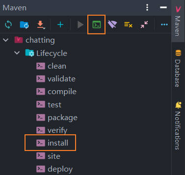
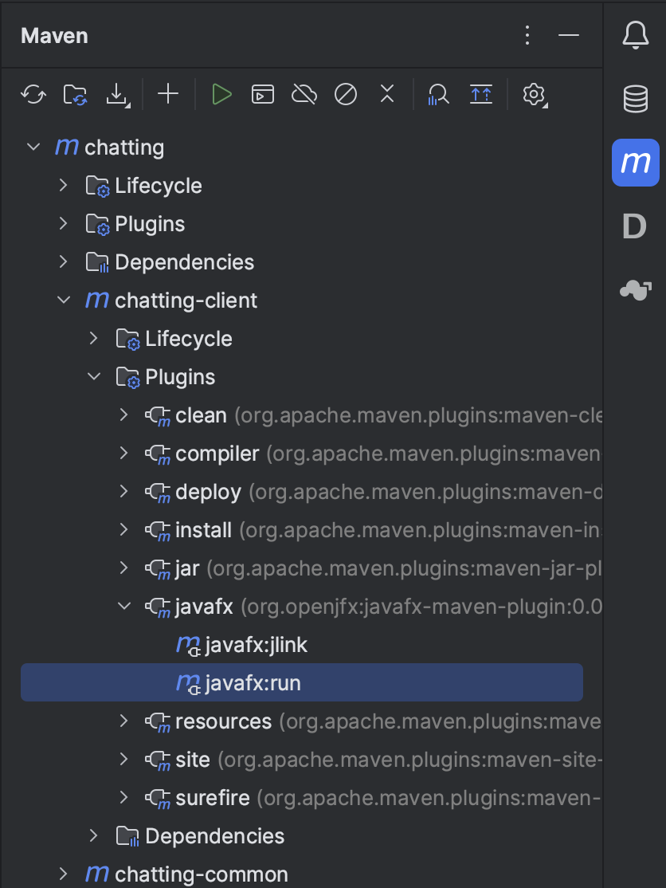

# Chatting

> Author: Haoyu Wang (王浩羽)
>
> ID: 11911612

 

**Chatting** is a simple online-chat application, based on JavaFX and Socket. In this assignment, you will need to implement a WeChat like program, but much simpler.

## Introduction

+ Server: multithreading + thread pool: 每个线程负责连接一个Client请求
+ Client GUI: JavaFX - 前后端分离: 一个fxml文件对应于一个独立的Controller程序.
  + `fxml`文件为静态文件, 包含GUI的全部组件
  + `Controller`程序为控制层, 负责处理Client后端和前端GUI的交互逻辑
+ Client 后端: 
  + `Client` 类: 该类独立于控制层存在, 其功能包括
    + 连接服务器
    + 发送请求
    + 发送消息
    + 接受信息并处理
    + 安全关闭客户端并与服务器断开连接
  + multithreading: `Client`类中一个专门的线程负责随时接收Server发送至Client的信息, 并根据消息类型及内容转发给各控制层内的Controller或调用Controller的方法. 其中, 消息的转发使用`Pipe Input/Output Stream`进行线程间的通讯.
+ Communication: 将socket的`Input/Output Stream`传入`Object Input/Output Stream`进行通信, 通过对象序列化的方式转递信息.


## Assignment Requirement

+ Server & Users (70 points)
  - [x] Server maintain a list of users that are currently connected to the Server
  - [x] Client can see a list of other users that are currently available to chat
  - [x] Client can select another user to start a one-to-one chat
  - [x] Client select multiple users to start a group chat
  - [x] Client can send text messages and receive the messages
  - [ ] Client can send emojis
+ GUI (15 points)
  - [x] Use javafx to implement GUI
  - [x] Main panel to show a list of chats
  - [x] Chat room: a separate chatroom window created for the chat
+ Exception Handling (15 points)
  - [x] When one Client is offline, other clients that have chat with the offline client will receive one  Server message in his chat content that notifies the client is offline.
  - [x] When Server is offline, all online clients will get a dialog window that notifies the Server is offline. Then the clients can check only history messages of the last chat. He can not begin a one-to-one chat or a group chat.
+ Bonus (12 points)
  - [x] Account Management: the server could support user registration and login.
  - [x] Sorted Chat List: user could see a list of available chats, sorted by their recent chat activities
  - [x] Chat History: client can get the chat history.
  - [ ] File Transfer


## Quick Start

### Install the Project

We will define the commonly used constants and models in the `chatting-common` model,
which is the dependency of `chatting-client` and `chatting-server`.

> This design is a common practice in many large projects.
> But it is not mandatory for you to follow this architecture.
> You can move the model codes to other places if you want.

Now, the first thing you need to do is to install the parent pom into the local maven repository.

```shell
mvn install
```

If you are a Windows user who has not configured Maven environment variables, you can run this command in IDEA by several ways as below:

- double click the Ctrl key in IDEA to bring up a "Run Anything" pop-up window, then enter the command
- click the "Execute Maven Goal" button on the top of Maven side bar, then enter the command
- simply click on the "install" option in the "Lifecycle" folder of Maven side bar

<p align="center">
  
</p>


Each time after modifing the codes in `chatting-common`, subproject needs to be reinstalled.

```shell
mvn install -pl chatting-common
```

### Run the Server

Ffind the `Main` class under the `chatting-server` model. Run the `main` method.

### Run the Client

If you are using JDK 1.8 with JavaFX bundled, you may find the `Main` class under the `chatting-client` model, and run the `main` method to start a client. Note that you can start multiple clients by clicking the _run_ button several times.

If you are using JDK in any higher version, please use the `javafx` plugin to run the client.

```shell
mvn javafx:run -pl chatting-client
```

Alternatively, you can find the goal in the plugin list, and click on it:



## Server

### properties

+ `clients`: a list that represents current online clients. 
+ `groupsMap`: record all chat group, including one-to-one and multi-user. A group uses Id to identify.


## User

### properties

+ `currentUsername`: username is unique
+ `onlineUserCnt`: current online user number(contain current user himself)
+ `userList`: other current online user list (not contain current user himself)
+ `chatGroupList` (id, group name): all of the current chat groups, contain one-to-one and multi-user chat group. 无论是一对一的聊天还是多人聊天，处理方式均相同，放在同一列表中
+ `currentChatId`: the id of current chat. 当前打开的聊天的id，使用id来确定唯一聊天，而不是聊天名字或群内用户
+ `chatContentList`: the content of current chat

### Operation

1. create one-to-one chat
   + select one user and click button "ok" to try to create one-to-one chat
     + if chat has existed in `chatGroupList` : set `currentChatId` 
     + else: send `CreateChatGroup Request` to Server, when get return message, set `currentChatId`
   + your chat content will focus on the one-to-one chat you want immediately.
2. create group chat
   + input group chat name, select several users and click button "ok" to create a multi-user chat
   + you can always create group chat successfully, including the same group name or the same group users
   +  send `CreateChatGroup Request` to Server, when get return message, set `currentChatId`
   +  your chat content will focus on the group chat you created immediately
3. select a chat
   + select a chat in `chatGroupList`, set  `currentChatId` 
   + update content when next "Request to Server"
4. send message
   + send a `Message` to Server
   + text can't be empty
5. Request to Server periodically
   + online user list (and number)
   + chat group list: other user may start a new chat with current user
   + chat content list: update chat content (1. other user may send new message; 2. current user may open another chat)

### Exceptions in Client

#### Connect

1. Connecting Server is failed

   

#### Login

1. username or password is empty

   

2. username does not exist

   

3. password is wrong

   

4. user has already been online

   

#### Signup

1. username has already exists

   

2. signup successfully


## Design

1. Info:

   + Client will only store some necessary info and update that from server periodically. For chat content, Client only maintain the current choose chat messages in local.

   + Server only send info to Client when a Client request specific info. Server maintain all chats and all message.


## Exception

1. One Client is offline: Server will give all chats of this offline user a extra message to notify he is offline

   

   If the offline client is online again, all his chat will get an extra message from Server: "User 'x' is online":

   

2. Server is down: all user will be notified. User can quit by himself elegantly. User can only check the last chat messages. He can not create a new one-to-one chat or group chat.

   

   If Client sends message, he will get:

   

   And Online User is set to be zero.


## Difficulty

1. `ListView` 控件, 在被选中时, 会发生高频刷新闪烁问题: C#有double buffer的解决措施, 但是javafx没找到好办法

2. javafx的fxml文件编写较复杂: 采用图形化界面 *javafx Scene Builder* 进行界面构建, 非常高效.

3. 客户端GUI界面关闭后, 仍有未处理的线程占用系统资源或占用端口: 在类`Client`中增加`close()`方法, 当负责GUI界面的线程关闭时, 需要执行该`close()`方法, 将其他必要的线程也全部终止, 并向Server发出`Disconnect`请求.

4. 回车发送消息：[JavaFX 实现回车发送信息，Ctrl+Enter换行](https://blog.csdn.net/wangpaiblog/article/details/121506912)

   为TextArea添加key press监听器, 当收到Enter后, 将判定发送消息或换行.

5. 发表情: 尚未解决

6. 发文件: 尚未解决


## License

This project is licensed under the MIT License - see the [LICENSE](LICENSE) file for details.
